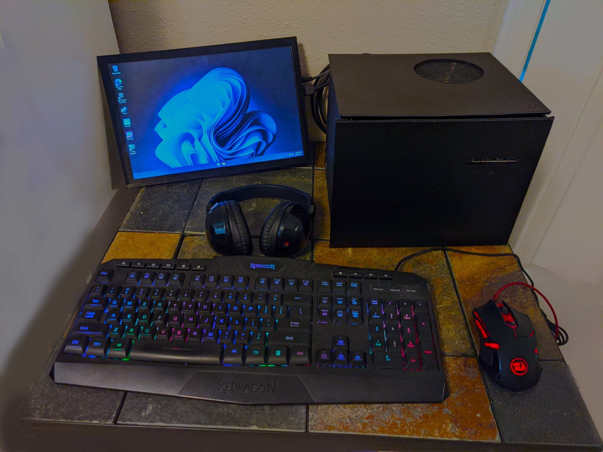
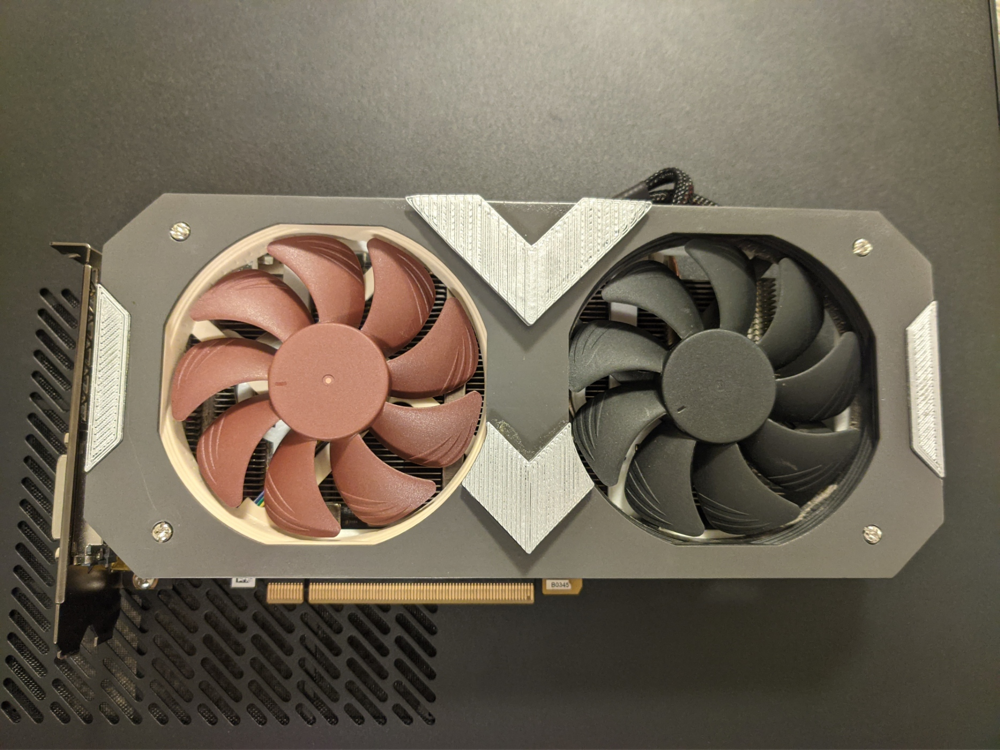
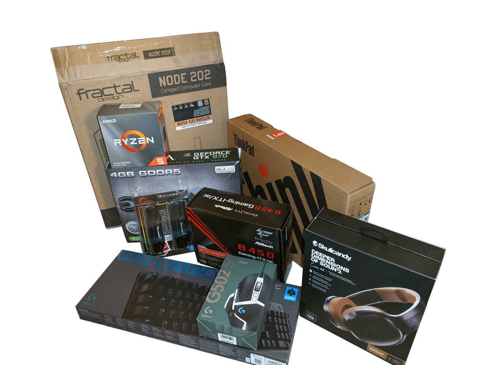

#  Desktop Mods

## Custom, Small Form Factor PCs
> Build a PC that fits in a backpack.

### Project Blackbox - An All-Custom Budget Build

Ever have a bunch of spare ingredients lying around to make something really good? Well, I had everything but a case to build a pretty decent PC.

So I built a case.

I won't lie, it's somewhat ramshackle-looking, but it's sturdy and performs well, and that was my goal.

### GPU Mod - A Custom, Noctua-themed Shroud

Zotac made one of the most interesting GPUs of the Geforce 10 series: The 1080 Mini. Massive power (for its time) in an incredibly small package. 
I got my hands on one for my backpack PC build, but it was missing both the shroud and fans that it came with.

Introducing the Noctua GTX 1080 Mini:

Inspired by the ASUS Noctua RTX 3070, this GPU has a custom-built shroud to help house two low-profile Noctua fans. 
They run nearly silent while keeping the GPU underneath at a cool 80 degrees, even when tucked away inside my backpack-sized PC.

## Background

I've been working in desktop computers since I was 12, tinkering with old desktops buried under the stairs and learning how they work...and don't work.

Things are pretty different now than they were back then. PC gaming has become hugely something of a sensation, and the **custom gaming PC** has rocketed in popularity.

